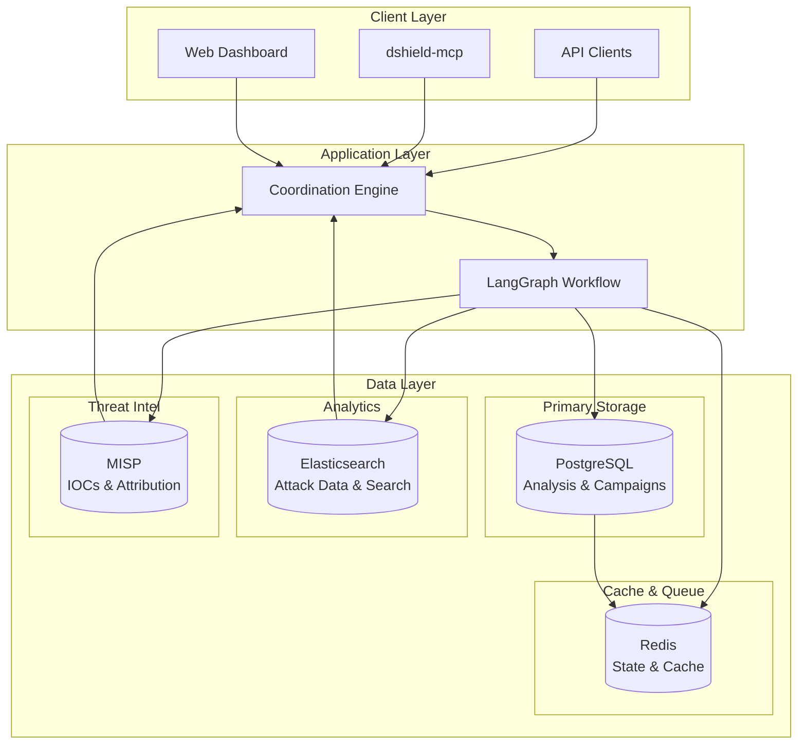
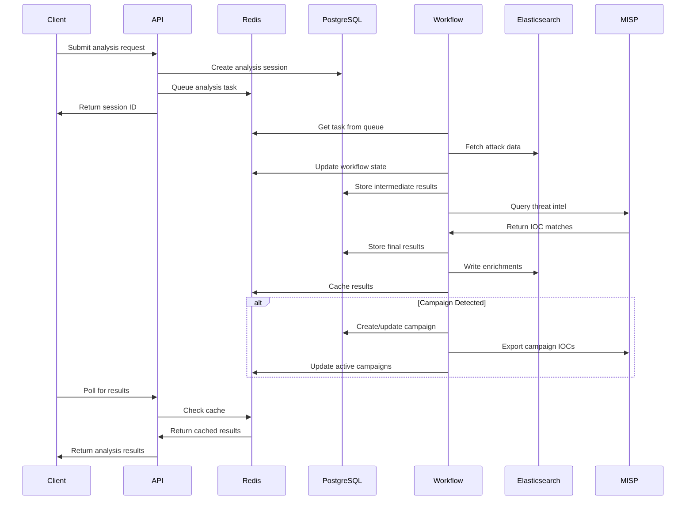
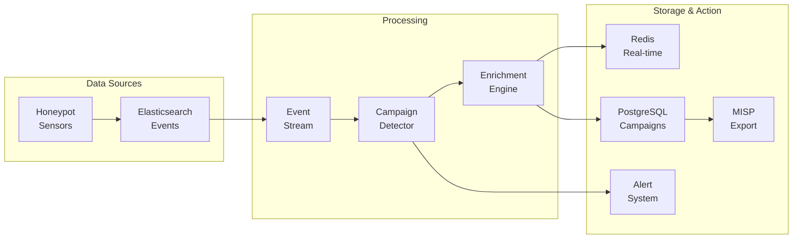

# Database Design and Workflow Architecture

**Project**: DShield Coordination Engine
**Document**: Database Design and Workflow Architecture
**Status**: Design Phase
**Version**: 2.0
**Last Updated**: July 31, 2025

## Executive Summary

This document outlines the multi-database architecture for the DShield Coordination Engine, leveraging PostgreSQL, Elasticsearch, Redis, and MISP to create a robust, scalable system for attack coordination analysis. The design balances performance, reliability, and academic credibility while integrating with existing DShield infrastructure.

---

## Table of Contents

1. [Current System Status](#current-system-status)
2. [Multi-Database Architecture Overview](#multi-database-architecture-overview)
3. [PostgreSQL Design (Primary Store)](#postgresql-design-primary-store)
4. [Elasticsearch Integration](#elasticsearch-integration)
5. [Redis Cache Layer](#redis-cache-layer)
6. [MISP Integration](#misp-integration)
7. [Data Flow Architecture](#data-flow-architecture)
8. [Implementation Strategy](#implementation-strategy)
9. [Performance & Scalability](#performance--scalability)
10. [Security & Compliance](#security--compliance)
11. [Migration & Deployment](#migration--deployment)

---

## Current System Status

### ✅ **Completed Components**
- **LangGraph Workflow System**: Complete multi-agent coordination analysis pipeline
- **Local LLM Integration**: Ollama service with cybersecurity-optimized prompts
- **API Framework**: FastAPI-based REST API with comprehensive authentication
- **Background Task Processing**: Celery task queue with Redis backend
- **Testing Framework**: 93 unit tests passing with 71% coverage
- **Code Quality**: All linting standards met, clean codebase

### 🔄 **Current Phase**
- **Phase 2**: Database Integration & Advanced Analytics
- **Priority**: Multi-database architecture design and implementation
- **Status**: Architecture planning with PostgreSQL, Elasticsearch, Redis, and MISP

---

## Multi-Database Architecture Overview

### **Architecture Principles**

1. **Separation of Concerns**: Each database handles what it does best
2. **Data Locality**: Keep data close to where it's processed
3. **Performance Optimization**: Cache hot data, archive cold data
4. **Reliability**: ACID compliance for critical data, eventual consistency for analytics

### **Database Roles**

| Database | Primary Role | Data Types | Characteristics |
|----------|-------------|------------|-----------------|
| **PostgreSQL** | Source of Truth | Analysis results, campaigns, audit trails | ACID, relational, durable |
| **Elasticsearch** | Analytics & Search | Attack data, time-series, enrichments | Fast search, aggregations |
| **Redis** | Cache & State | Active workflows, rate limits, hot data | In-memory, fast, ephemeral |
| **MISP** | Threat Intelligence | IOCs, attributions, threat data | Standardized, shareable |

### **Architecture Diagram**



---

## PostgreSQL Design (Primary Store)

### **Core Schema Design**

PostgreSQL serves as the authoritative source for all analysis results, campaign tracking, and system metadata.

#### **Analysis Sessions Table**
```sql
-- Core analysis sessions with enhanced campaign support
CREATE TABLE analysis_sessions (
    id UUID PRIMARY KEY DEFAULT gen_random_uuid(),
    user_id VARCHAR(255) NOT NULL,
    status VARCHAR(50) NOT NULL CHECK (status IN ('queued', 'processing', 'completed', 'failed', 'cancelled')),
    analysis_depth VARCHAR(20) NOT NULL CHECK (analysis_depth IN ('minimal', 'standard', 'deep', 'forensic')),
    created_at TIMESTAMP WITH TIME ZONE DEFAULT NOW(),
    started_at TIMESTAMP WITH TIME ZONE,
    completed_at TIMESTAMP WITH TIME ZONE,
    processing_time_seconds FLOAT,
    coordination_confidence FLOAT CHECK (coordination_confidence >= 0 AND coordination_confidence <= 1),
    campaign_id UUID REFERENCES campaigns(id),
    final_assessment JSONB,
    metadata JSONB,
    callback_url VARCHAR(500),
    priority INTEGER DEFAULT 5 CHECK (priority >= 1 AND priority <= 10)
);

-- Performance indexes
CREATE INDEX idx_analysis_sessions_user_id ON analysis_sessions(user_id);
CREATE INDEX idx_analysis_sessions_created_at ON analysis_sessions(created_at DESC);
CREATE INDEX idx_analysis_sessions_status ON analysis_sessions(status);
CREATE INDEX idx_analysis_sessions_campaign_id ON analysis_sessions(campaign_id);
CREATE INDEX idx_analysis_sessions_priority_status ON analysis_sessions(priority DESC, status);
```

#### **Campaign Management**
```sql
-- Campaign tracking for coordinated attacks
CREATE TABLE campaigns (
    id UUID PRIMARY KEY DEFAULT gen_random_uuid(),
    name VARCHAR(255) NOT NULL,
    description TEXT,
    first_seen TIMESTAMP WITH TIME ZONE NOT NULL,
    last_seen TIMESTAMP WITH TIME ZONE NOT NULL,
    status VARCHAR(50) CHECK (status IN ('active', 'dormant', 'concluded', 'monitoring')),
    confidence_threshold FLOAT DEFAULT 0.7,
    attack_count INTEGER DEFAULT 0,
    unique_sources INTEGER DEFAULT 0,
    misp_event_id VARCHAR(255),
    threat_actor_attribution VARCHAR(255),
    ttps JSONB,
    iocs JSONB,
    metadata JSONB,
    created_at TIMESTAMP WITH TIME ZONE DEFAULT NOW(),
    updated_at TIMESTAMP WITH TIME ZONE DEFAULT NOW()
);

-- Campaign-session relationships
CREATE TABLE campaign_sessions (
    campaign_id UUID REFERENCES campaigns(id) ON DELETE CASCADE,
    analysis_session_id UUID REFERENCES analysis_sessions(id) ON DELETE CASCADE,
    confidence_score FLOAT NOT NULL,
    evidence_factors JSONB,
    added_at TIMESTAMP WITH TIME ZONE DEFAULT NOW(),
    PRIMARY KEY (campaign_id, analysis_session_id)
);

-- Campaign indicators
CREATE TABLE campaign_indicators (
    id UUID PRIMARY KEY DEFAULT gen_random_uuid(),
    campaign_id UUID REFERENCES campaigns(id) ON DELETE CASCADE,
    indicator_type VARCHAR(50) NOT NULL CHECK (indicator_type IN ('ip', 'domain', 'hash', 'pattern', 'behavior')),
    indicator_value TEXT NOT NULL,
    confidence FLOAT DEFAULT 1.0,
    first_seen TIMESTAMP WITH TIME ZONE DEFAULT NOW(),
    last_seen TIMESTAMP WITH TIME ZONE DEFAULT NOW(),
    occurrence_count INTEGER DEFAULT 1,
    metadata JSONB
);

CREATE INDEX idx_campaign_indicators_campaign_id ON campaign_indicators(campaign_id);
CREATE INDEX idx_campaign_indicators_type_value ON campaign_indicators(indicator_type, indicator_value);
CREATE INDEX idx_campaign_indicators_confidence ON campaign_indicators(confidence DESC);
```

#### **Attack Sessions (Normalized)**
```sql
-- Individual attack sessions from honeypots
CREATE TABLE attack_sessions (
    id UUID PRIMARY KEY DEFAULT gen_random_uuid(),
    analysis_session_id UUID REFERENCES analysis_sessions(id) ON DELETE CASCADE,
    elasticsearch_id VARCHAR(255), -- Reference to ES document
    source_ip INET NOT NULL,
    destination_ip INET,
    timestamp TIMESTAMP WITH TIME ZONE NOT NULL,
    payload TEXT NOT NULL,
    payload_hash VARCHAR(64), -- SHA256 of payload
    target_port INTEGER CHECK (target_port >= 1 AND target_port <= 65535),
    protocol VARCHAR(10),
    attack_type VARCHAR(50),
    created_at TIMESTAMP WITH TIME ZONE DEFAULT NOW()
);

-- Indexes for performance
CREATE INDEX idx_attack_sessions_analysis_id ON attack_sessions(analysis_session_id);
CREATE INDEX idx_attack_sessions_source_ip ON attack_sessions(source_ip);
CREATE INDEX idx_attack_sessions_timestamp ON attack_sessions(timestamp);
CREATE INDEX idx_attack_sessions_es_id ON attack_sessions(elasticsearch_id);
CREATE INDEX idx_attack_sessions_payload_hash ON attack_sessions(payload_hash);
```

#### **Analysis Results Storage**
```sql
-- Detailed analysis results with evidence
CREATE TABLE analysis_results (
    id UUID PRIMARY KEY DEFAULT gen_random_uuid(),
    analysis_session_id UUID REFERENCES analysis_sessions(id) ON DELETE CASCADE,
    evidence_breakdown JSONB NOT NULL,
    temporal_correlation_score FLOAT,
    behavioral_similarity_score FLOAT,
    infrastructure_correlation_score FLOAT,
    geographic_distribution_score FLOAT,
    tool_results JSONB,
    enrichment_data JSONB,
    ml_model_outputs JSONB,
    processing_steps JSONB,
    errors JSONB,
    created_at TIMESTAMP WITH TIME ZONE DEFAULT NOW()
);

-- Tool execution results
CREATE TABLE tool_execution_logs (
    id UUID PRIMARY KEY DEFAULT gen_random_uuid(),
    analysis_session_id UUID REFERENCES analysis_sessions(id) ON DELETE CASCADE,
    tool_name VARCHAR(100) NOT NULL,
    execution_status VARCHAR(50) NOT NULL,
    started_at TIMESTAMP WITH TIME ZONE DEFAULT NOW(),
    completed_at TIMESTAMP WITH TIME ZONE,
    input_parameters JSONB,
    output_results JSONB,
    error_details JSONB
);
```

#### **User & API Management**
```sql
-- Enhanced API key management with quotas
CREATE TABLE api_keys (
    id UUID PRIMARY KEY DEFAULT gen_random_uuid(),
    key_hash VARCHAR(255) UNIQUE NOT NULL,
    user_id VARCHAR(255) NOT NULL,
    description TEXT,
    permissions JSONB DEFAULT '["read", "write"]'::jsonb,
    is_active BOOLEAN DEFAULT TRUE,
    rate_limit_per_minute INTEGER DEFAULT 10,
    rate_limit_per_hour INTEGER DEFAULT 100,
    rate_limit_per_day INTEGER DEFAULT 1000,
    quota_analyses_per_month INTEGER DEFAULT 10000,
    analyses_used_this_month INTEGER DEFAULT 0,
    created_at TIMESTAMP WITH TIME ZONE DEFAULT NOW(),
    expires_at TIMESTAMP WITH TIME ZONE,
    last_used_at TIMESTAMP WITH TIME ZONE,
    last_used_ip INET
);

-- API usage tracking
CREATE TABLE api_usage_logs (
    id UUID PRIMARY KEY DEFAULT gen_random_uuid(),
    api_key_id UUID REFERENCES api_keys(id),
    endpoint VARCHAR(100) NOT NULL,
    method VARCHAR(10) NOT NULL,
    request_timestamp TIMESTAMP WITH TIME ZONE DEFAULT NOW(),
    response_status INTEGER,
    response_time_ms INTEGER,
    request_size_bytes INTEGER,
    response_size_bytes INTEGER,
    client_ip INET,
    user_agent TEXT
);

CREATE INDEX idx_api_usage_logs_key_timestamp ON api_usage_logs(api_key_id, request_timestamp DESC);
CREATE INDEX idx_api_usage_logs_endpoint ON api_usage_logs(endpoint);
```

### **Partitioning Strategy**

```sql
-- Partition large tables by date for performance
CREATE TABLE analysis_sessions_2025_q3 PARTITION OF analysis_sessions
FOR VALUES FROM ('2025-07-01') TO ('2025-10-01');

CREATE TABLE attack_sessions_2025_q3 PARTITION OF attack_sessions
FOR VALUES FROM ('2025-07-01') TO ('2025-10-01');

-- Automatic partition creation function
CREATE OR REPLACE FUNCTION create_monthly_partitions()
RETURNS void AS $$
DECLARE
    start_date date;
    end_date date;
    partition_name text;
BEGIN
    start_date := date_trunc('month', CURRENT_DATE);
    end_date := start_date + interval '1 month';

    -- Analysis sessions partition
    partition_name := 'analysis_sessions_' || to_char(start_date, 'YYYY_MM');
    EXECUTE format('CREATE TABLE IF NOT EXISTS %I PARTITION OF analysis_sessions FOR VALUES FROM (%L) TO (%L)',
        partition_name, start_date, end_date);

    -- Attack sessions partition
    partition_name := 'attack_sessions_' || to_char(start_date, 'YYYY_MM');
    EXECUTE format('CREATE TABLE IF NOT EXISTS %I PARTITION OF attack_sessions FOR VALUES FROM (%L) TO (%L)',
        partition_name, start_date, end_date);
END;
$$ LANGUAGE plpgsql;

-- Schedule monthly partition creation
SELECT cron.schedule('create-monthly-partitions', '0 0 1 * *', 'SELECT create_monthly_partitions();');
```

---

## Elasticsearch Integration

### **Purpose**
Elasticsearch handles time-series attack data, provides fast search capabilities, and stores enriched attack session data.

### **Index Structure**

#### **Attack Data Index (Existing)**
```json
{
  "settings": {
    "number_of_shards": 5,
    "number_of_replicas": 1,
    "index.lifecycle.name": "dshield_attack_policy"
  },
  "mappings": {
    "properties": {
      "timestamp": { "type": "date" },
      "source_ip": { "type": "ip" },
      "destination_ip": { "type": "ip" },
      "port": { "type": "integer" },
      "protocol": { "type": "keyword" },
      "payload": { "type": "text" },
      "payload_hash": { "type": "keyword" },
      "honeypot_id": { "type": "keyword" },
      "attack_type": { "type": "keyword" }
    }
  }
}
```

#### **Coordination Enrichment Index**
```json
{
  "settings": {
    "number_of_shards": 3,
    "number_of_replicas": 1
  },
  "mappings": {
    "properties": {
      "attack_session_id": { "type": "keyword" },
      "analysis_session_id": { "type": "keyword" },
      "campaign_id": { "type": "keyword" },
      "coordination_metadata": {
        "properties": {
          "confidence_score": { "type": "float" },
          "is_coordinated": { "type": "boolean" },
          "cluster_id": { "type": "keyword" },
          "temporal_group": { "type": "keyword" },
          "behavioral_group": { "type": "keyword" },
          "evidence_factors": {
            "properties": {
              "temporal_correlation": { "type": "float" },
              "behavioral_similarity": { "type": "float" },
              "infrastructure_correlation": { "type": "float" },
              "geographic_distribution": { "type": "float" }
            }
          }
        }
      },
      "enrichment_data": {
        "properties": {
          "asn": { "type": "keyword" },
          "country": { "type": "keyword" },
          "organization": { "type": "text" },
          "threat_feeds": { "type": "keyword" },
          "known_malicious": { "type": "boolean" }
        }
      },
      "analysis_timestamp": { "type": "date" },
      "ttl": { "type": "date" }
    }
  }
}
```

#### **Campaign Analytics Index**
```json
{
  "mappings": {
    "properties": {
      "campaign_id": { "type": "keyword" },
      "timestamp": { "type": "date" },
      "metric_type": { "type": "keyword" },
      "metrics": {
        "properties": {
          "active_sources": { "type": "integer" },
          "attack_rate": { "type": "float" },
          "geographic_spread": { "type": "integer" },
          "new_indicators": { "type": "integer" },
          "confidence_trend": { "type": "float" }
        }
      }
    }
  }
}
```

### **Data Lifecycle Management**

```json
{
  "policy": {
    "phases": {
      "hot": {
        "actions": {
          "rollover": {
            "max_age": "7d",
            "max_size": "50GB"
          }
        }
      },
      "warm": {
        "min_age": "7d",
        "actions": {
          "shrink": {
            "number_of_shards": 1
          },
          "forcemerge": {
            "max_num_segments": 1
          }
        }
      },
      "cold": {
        "min_age": "30d",
        "actions": {
          "freeze": {}
        }
      },
      "delete": {
        "min_age": "90d",
        "actions": {
          "delete": {}
        }
      }
    }
  }
}
```

---

## Redis Cache Layer

### **Purpose**
Redis provides high-performance caching, workflow state management, and real-time data structures.

### **Data Structures**

#### **Analysis Workflow State**
```python
# Active workflow states (1-hour TTL)
{
    "analysis:state:{session_id}": {
        "type": "hash",
        "fields": {
            "status": "processing",
            "current_step": "pattern_analysis",
            "started_at": "2025-07-31T10:00:00Z",
            "intermediate_results": "{}",
            "errors": "[]"
        },
        "ttl": 3600
    }
}
```

#### **Result Caching**
```python
# Analysis results cache (24-hour TTL)
{
    "cache:analysis:{session_id}": {
        "type": "string",
        "value": "{compressed_json_result}",
        "ttl": 86400
    },

    # Campaign data cache (6-hour TTL)
    "cache:campaign:{campaign_id}": {
        "type": "string",
        "value": "{campaign_data}",
        "ttl": 21600
    }
}
```

#### **Rate Limiting**
```python
# API rate limiting with sliding window
{
    "ratelimit:{api_key}:{endpoint}": {
        "type": "sorted_set",
        "members": {
            "timestamp_ms": "request_id"
        }
    },

    # Global rate limits
    "ratelimit:global:{endpoint}": {
        "type": "hyperloglog",
        "purpose": "unique IP counting"
    }
}
```

#### **Real-time Campaign Tracking**
```python
# Active campaigns
{
    "campaigns:active": {
        "type": "set",
        "members": ["campaign_id_1", "campaign_id_2"]
    },

    # Campaign indicators
    "campaign:ips:{campaign_id}": {
        "type": "set",
        "members": ["192.168.1.1", "10.0.0.1"]
    },

    # Campaign activity stream
    "campaign:activity:{campaign_id}": {
        "type": "stream",
        "entries": [
            {
                "timestamp": "1627384953123-0",
                "data": {
                    "event": "new_attack",
                    "source_ip": "192.168.1.1",
                    "confidence": 0.85
                }
            }
        ]
    }
}
```

#### **Queue Management**
```python
# Celery task queues
{
    "celery:queue:analysis": {
        "type": "list",
        "purpose": "analysis task queue"
    },

    "celery:queue:enrichment": {
        "type": "list",
        "purpose": "enrichment task queue"
    },

    # Priority queue for urgent analyses
    "priority:queue:analysis": {
        "type": "sorted_set",
        "score": "priority_value"
    }
}
```

### **Redis Configuration**

```conf
# redis.conf
maxmemory 8gb
maxmemory-policy allkeys-lru
save 900 1
save 300 10
save 60 10000
appendonly yes
appendfsync everysec
```

---

## MISP Integration

### **Purpose**
MISP handles threat intelligence sharing, IOC management, and campaign attribution.

### **Integration Architecture**

#### **Event Structure for Campaigns**
```python
{
    "Event": {
        "info": "DShield Coordinated Campaign: Operation RedStorm",
        "threat_level_id": "2",
        "analysis": "2",
        "distribution": "3",
        "Attribute": [
            {
                "type": "ip-src",
                "value": "192.168.1.1",
                "category": "Network activity",
                "comment": "Coordination confidence: 0.92"
            },
            {
                "type": "pattern-in-traffic",
                "value": "GET /admin.php?cmd=",
                "category": "Payload delivery"
            },
            {
                "type": "campaign-name",
                "value": "RedStorm",
                "category": "Attribution"
            }
        ],
        "Tag": [
            {"name": "dshield:coordinated-attack"},
            {"name": "confidence:high"},
            {"name": "tlp:amber"}
        ],
        "Object": [
            {
                "name": "attack-pattern",
                "meta-category": "ttp",
                "Attribute": [
                    {
                        "type": "text",
                        "object_relation": "name",
                        "value": "Synchronized Web Shell Deployment"
                    }
                ]
            }
        ]
    }
}
```

#### **Synchronization Strategy**

```python
class MISPCampaignSync:
    """Bi-directional sync between DShield and MISP"""

    async def export_campaign_to_misp(self, campaign_id: UUID):
        # Get campaign data from PostgreSQL
        campaign = await self.db.get_campaign(campaign_id)
        indicators = await self.db.get_campaign_indicators(campaign_id)

        # Create MISP event
        event = MISPEvent()
        event.info = f"DShield Campaign: {campaign.name}"
        event.threat_level_id = self.calculate_threat_level(campaign.confidence_threshold)

        # Add indicators
        for indicator in indicators:
            event.add_attribute(
                indicator.type,
                indicator.value,
                comment=f"Confidence: {indicator.confidence}"
            )

        # Add campaign metadata
        event.add_attribute('campaign-name', campaign.name)
        event.add_attribute('first-seen', campaign.first_seen.isoformat())

        # Publish to MISP
        result = self.misp.add_event(event)

        # Update campaign with MISP event ID
        await self.db.update_campaign(
            campaign_id,
            misp_event_id=result['Event']['id']
        )

    async def import_threat_intel_from_misp(self):
        # Query MISP for relevant events
        events = self.misp.search(
            tags=['honeypot', 'coordinated-attack'],
            timestamp='7d'
        )

        for event in events:
            # Extract IOCs and create enrichment data
            await self.process_misp_event(event)
```

---

## Data Flow Architecture

### **Analysis Workflow Data Flow**



### **Real-time Campaign Monitoring**



---

## Implementation Strategy

### **Phase 1: Foundation (Weeks 1-2)**

#### Tasks:
1. **PostgreSQL Setup**
   - [ ] Install and configure PostgreSQL 15+
   - [ ] Create database schema with all tables
   - [ ] Set up partitioning for large tables
   - [ ] Configure connection pooling (pgBouncer)
   - [ ] Implement backup strategy

2. **Redis Configuration**
   - [ ] Deploy Redis 7+ with persistence
   - [ ] Configure memory limits and eviction policies
   - [ ] Set up Redis Sentinel for HA
   - [ ] Create data structure templates
   - [ ] Implement connection pooling

3. **Basic Integration**
   - [ ] SQLAlchemy ORM models
   - [ ] Redis client wrapper
   - [ ] Database migration framework (Alembic)
   - [ ] Connection health checks
   - [ ] Basic CRUD operations

#### Deliverables:
- ✅ Database infrastructure operational
- ✅ Basic data models implemented
- ✅ Health check endpoints
- ✅ Migration scripts ready

### **Phase 2: Elasticsearch & Workflow Integration (Weeks 3-4)**

#### Tasks:
1. **Elasticsearch Setup**
   - [ ] Create coordination indices
   - [ ] Configure index lifecycle policies
   - [ ] Set up index templates
   - [ ] Implement bulk operations
   - [ ] Create aggregation queries

2. **Workflow State Management**
   - [ ] Redis-based state persistence
   - [ ] Workflow checkpointing
   - [ ] State recovery mechanisms
   - [ ] Progress tracking

3. **Result Storage Pipeline**
   - [ ] Analysis result persistence
   - [ ] Elasticsearch enrichment writing
   - [ ] Cache warming strategies
   - [ ] Data consistency checks

#### Deliverables:
- ✅ Full workflow persistence
- ✅ Elasticsearch enrichments operational
- ✅ Result caching implemented
- ✅ Recovery mechanisms tested

### **Phase 3: MISP & Advanced Features (Weeks 5-6)**

#### Tasks:
1. **MISP Integration**
   - [ ] PyMISP client setup
   - [ ] Campaign export functionality
   - [ ] IOC synchronization
   - [ ] Threat intel import
   - [ ] Attribution mapping

2. **Campaign Management**
   - [ ] Campaign detection algorithms
   - [ ] Campaign tracking UI
   - [ ] Historical campaign analysis
   - [ ] Campaign merging logic

3. **Performance Optimization**
   - [ ] Query optimization
   - [ ] Caching strategies
   - [ ] Batch processing
   - [ ] Resource monitoring

#### Deliverables:
- ✅ MISP integration complete
- ✅ Campaign management operational
- ✅ Performance benchmarks met
- ✅ Monitoring dashboards

### **Phase 4: Production Hardening (Weeks 7-8)**

#### Tasks:
1. **Security Hardening**
   - [ ] Encryption at rest
   - [ ] Network security
   - [ ] Access control
   - [ ] Audit logging
   - [ ] Vulnerability scanning

2. **High Availability**
   - [ ] PostgreSQL replication
   - [ ] Redis clustering
   - [ ] Elasticsearch cluster
   - [ ] Load balancing

3. **Operational Excellence**
   - [ ] Monitoring setup (Prometheus/Grafana)
   - [ ] Alerting rules
   - [ ] Backup automation
   - [ ] Disaster recovery testing
   - [ ] Documentation

#### Deliverables:
- ✅ Production-ready security
- ✅ HA configuration complete
- ✅ Monitoring operational
- ✅ Full documentation

---

## Performance & Scalability

### **Performance Targets**

| Metric | Target | Measurement Method |
|--------|--------|-------------------|
| Analysis Latency | < 5 minutes for 1000 sessions | End-to-end timing |
| API Response Time | < 100ms for cached, < 1s for DB queries | 95th percentile |
| Throughput | 100+ analyses/minute | Load testing |
| Elasticsearch Query | < 500ms for complex aggregations | Query profiling |
| Cache Hit Ratio | > 80% for repeated queries | Redis statistics |

### **Scalability Design**

#### **Horizontal Scaling**
```yaml
# PostgreSQL: Read replicas for queries
postgresql:
  master:
    host: pg-master
  replicas:
    - host: pg-replica-1
    - host: pg-replica-2

# Redis: Cluster mode for sharding
redis:
  cluster:
    nodes: 6
    replicas: 1
    shards: 3

# Elasticsearch: Multi-node cluster
elasticsearch:
  master_nodes: 3
  data_nodes: 5
  coordinating_nodes: 2
```

#### **Resource Optimization**
```python
# Connection pooling configuration
DATABASE_POOL_SIZE = 20
DATABASE_MAX_OVERFLOW = 30
REDIS_MAX_CONNECTIONS = 100

# Batch processing for efficiency
BATCH_SIZE = 1000
PARALLEL_WORKERS = 4

# Cache configuration
CACHE_TTL = {
    'analysis_result': 86400,  # 24 hours
    'campaign_data': 21600,    # 6 hours
    'threat_intel': 3600,      # 1 hour
    'rate_limit': 60           # 1 minute
}
```

---

## Security & Compliance

### **Data Protection**

#### **Encryption**
```python
# At-rest encryption
PostgreSQL: Transparent Data Encryption (TDE)
Redis: Encryption via stunnel/TLS
Elasticsearch: Encrypted indices

# In-transit encryption
All connections: TLS 1.3 minimum
Internal services: mTLS with certificate rotation
```

#### **Access Control**
```sql
-- Row-level security for multi-tenancy
ALTER TABLE analysis_sessions ENABLE ROW LEVEL SECURITY;

CREATE POLICY user_sessions ON analysis_sessions
    FOR ALL TO application_users
    USING (user_id = current_setting('app.current_user_id'));

-- Separate roles for services
CREATE ROLE coordination_api WITH LOGIN PASSWORD 'secure_password';
CREATE ROLE workflow_engine WITH LOGIN PASSWORD 'secure_password';
CREATE ROLE readonly_analytics WITH LOGIN PASSWORD 'secure_password';

GRANT SELECT, INSERT, UPDATE ON analysis_sessions TO coordination_api;
GRANT SELECT, INSERT ON analysis_results TO workflow_engine;
GRANT SELECT ON ALL TABLES IN SCHEMA public TO readonly_analytics;
```

### **Audit & Compliance**

#### **Comprehensive Audit Trail**
```sql
-- Audit trigger for all changes
CREATE TABLE audit_log (
    id UUID PRIMARY KEY DEFAULT gen_random_uuid(),
    table_name VARCHAR(100) NOT NULL,
    operation VARCHAR(10) NOT NULL,
    user_id VARCHAR(255),
    timestamp TIMESTAMP WITH TIME ZONE DEFAULT NOW(),
    row_id UUID,
    old_data JSONB,
    new_data JSONB,
    ip_address INET,
    session_id VARCHAR(255)
);

CREATE OR REPLACE FUNCTION audit_trigger_function()
RETURNS TRIGGER AS $$
BEGIN
    INSERT INTO audit_log (
        table_name, operation, user_id, row_id,
        old_data, new_data, ip_address, session_id
    ) VALUES (
        TG_TABLE_NAME,
        TG_OP,
        current_setting('app.current_user_id', TRUE),
        COALESCE(NEW.id, OLD.id),
        CASE WHEN TG_OP IN ('UPDATE', 'DELETE') THEN to_jsonb(OLD) END,
        CASE WHEN TG_OP IN ('INSERT', 'UPDATE') THEN to_jsonb(NEW) END,
        inet(current_setting('app.client_ip', TRUE)),
        current_setting('app.session_id', TRUE)
    );
    RETURN COALESCE(NEW, OLD);
END;
$$ LANGUAGE plpgsql;

-- Apply audit trigger to critical tables
CREATE TRIGGER audit_analysis_sessions
    AFTER INSERT OR UPDATE OR DELETE ON analysis_sessions
    FOR EACH ROW EXECUTE FUNCTION audit_trigger_function();

CREATE TRIGGER audit_campaigns
    AFTER INSERT OR UPDATE OR DELETE ON campaigns
    FOR EACH ROW EXECUTE FUNCTION audit_trigger_function();
```

#### **Data Retention & Privacy**
```python
class DataRetentionManager:
    """Manage data retention policies"""

    async def apply_retention_policies(self):
        # Analysis data: 90 days
        await self.db.execute("""
            DELETE FROM analysis_sessions
            WHERE created_at < NOW() - INTERVAL '90 days'
            AND status = 'completed'
        """)

        # Audit logs: 1 year
        await self.db.execute("""
            DELETE FROM audit_log
            WHERE timestamp < NOW() - INTERVAL '365 days'
        """)

        # API logs: 30 days
        await self.db.execute("""
            DELETE FROM api_usage_logs
            WHERE request_timestamp < NOW() - INTERVAL '30 days'
        """)

        # Elasticsearch: Use ILM policies
        # Redis: Auto-expiration via TTL
```

---

## Migration & Deployment

### **Migration Strategy**

#### **Database Migrations**
```python
# Alembic migration example
"""Initial multi-database schema

Revision ID: 001_multi_db_architecture
Create Date: 2025-07-31 10:00:00.000000
"""

from alembic import op
import sqlalchemy as sa
from sqlalchemy.dialects import postgresql

def upgrade():
    # Create campaigns table
    op.create_table(
        'campaigns',
        sa.Column('id', postgresql.UUID(as_uuid=True)),
        sa.Column('name', sa.String(255), nullable=False),
        sa.Column('first_seen', sa.DateTime(timezone=True)),
        # ... other columns
    )

    # Add campaign_id to analysis_sessions
    op.add_column(
        'analysis_sessions',
        sa.Column('campaign_id', postgresql.UUID(as_uuid=True))
    )

    # Create indices
    op.create_index(
        'idx_campaigns_status',
        'campaigns',
        ['status']
    )

def downgrade():
    op.drop_table('campaigns')
    op.drop_column('analysis_sessions', 'campaign_id')
```

#### **Zero-Downtime Deployment**
```yaml
# Blue-green deployment strategy
deployment:
  strategy: blue_green
  steps:
    - name: Deploy to green environment
    - name: Run database migrations
    - name: Warm caches
    - name: Run health checks
    - name: Switch traffic to green
    - name: Monitor for errors
    - name: Keep blue as fallback
```

### **Monitoring Setup**

#### **Key Metrics**
```yaml
# Prometheus metrics
metrics:
  - name: coordination_analysis_duration_seconds
    type: histogram
    help: Time taken to complete coordination analysis

  - name: campaign_detections_total
    type: counter
    help: Total number of campaigns detected

  - name: database_query_duration_seconds
    type: histogram
    help: Database query execution time
    labels: [database, operation]

  - name: cache_hit_ratio
    type: gauge
    help: Redis cache hit ratio

  - name: elasticsearch_enrichment_lag_seconds
    type: gauge
    help: Lag between analysis and enrichment
```

#### **Alerting Rules**
```yaml
groups:
  - name: coordination_engine
    rules:
      - alert: HighAnalysisLatency
        expr: coordination_analysis_duration_seconds{quantile="0.95"} > 300
        for: 5m
        annotations:
          summary: "Analysis taking longer than 5 minutes"

      - alert: LowCacheHitRatio
        expr: cache_hit_ratio < 0.5
        for: 10m
        annotations:
          summary: "Cache hit ratio below 50%"

      - alert: DatabaseConnectionPoolExhausted
        expr: database_pool_available_connections == 0
        for: 1m
        annotations:
          summary: "No available database connections"
```

---

## Next Steps

### **Immediate Actions (Week 1)**
1. [ ] Review and approve database schema
2. [ ] Set up development environment with all databases
3. [ ] Create infrastructure provisioning scripts
4. [ ] Begin PostgreSQL schema implementation
5. [ ] Configure Redis and create client libraries

### **Short-term Goals (Month 1)**
1. [ ] Complete Phase 1 & 2 implementation
2. [ ] Integration testing across all databases
3. [ ] Performance benchmarking
4. [ ] Security audit of data flows
5. [ ] Documentation of all interfaces

### **Long-term Objectives (Quarter)**
1. [ ] Production deployment
2. [ ] MISP community integration
3. [ ] Advanced analytics dashboard
4. [ ] Machine learning pipeline
5. [ ] Academic validation study

---

## Conclusion

This multi-database architecture leverages the strengths of each technology:

- **PostgreSQL** provides ACID compliance for critical data
- **Elasticsearch** enables powerful analytics and search
- **Redis** delivers real-time performance and caching
- **MISP** integrates with the threat intelligence community

The design balances performance, reliability, and academic credibility while maintaining operational simplicity. The phased implementation approach ensures steady progress toward a production-ready system.

---

**Document Version**: 2.0
**Last Updated**: July 31, 2025
**Next Review**: August 7, 2025
**Status**: Ready for Implementation Review
